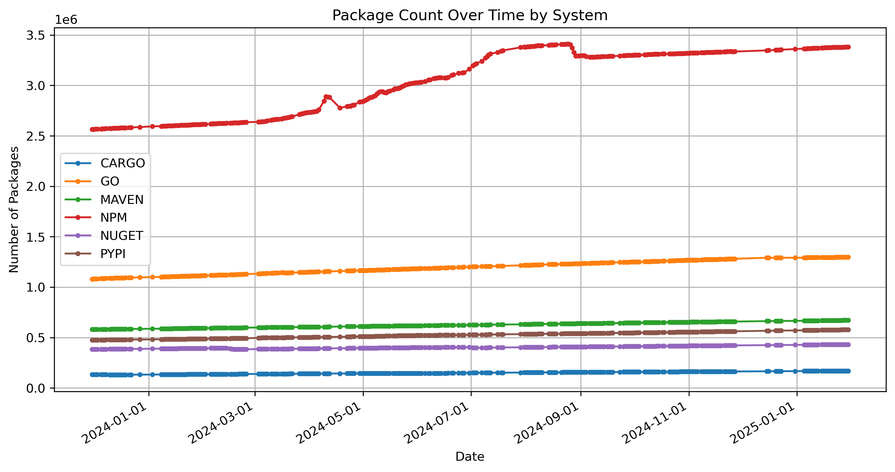
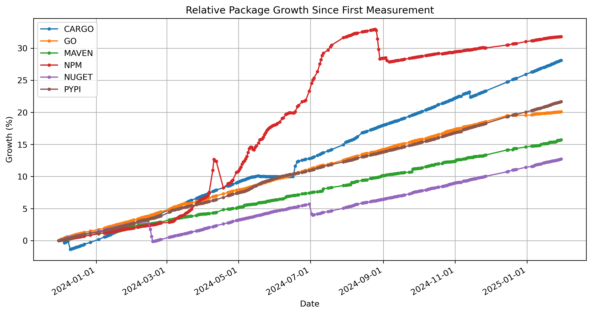

longitudinal study of package repositories per <https://deps.dev/_/stats>

Utils:

###  get_package_stats.py

`get_package_stats.py` compute the total number of dependents

```
....
Version 2.9.0: 885 dependents
Version 2.9.1: 1170 dependents
Version 3.0.0-alpha1: 79 dependents
Version 3.0.0-beta1: 32 dependents
Version 3.0.0-beta2: 188 dependents
Total unique dependents for org.apache.logging.log4j:log4j-api: 15378
```

## extract-history.sh

go over each past commit and copy version of stats.json at that commit in directory `history`

## create-graph.py

Create line charts for number of dependencies over time

### Absolute Growth (deps.dev data)


Something happened in NPM counting

### Relative Growth (deps.dev data)


Max derivative is Cargo


