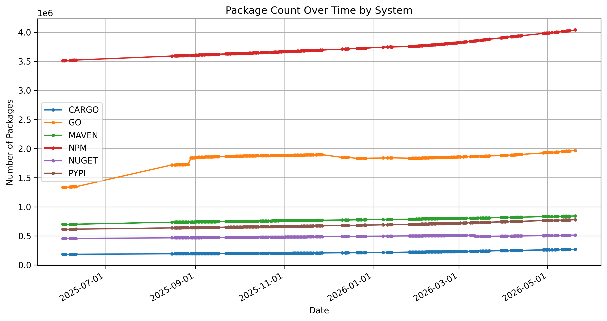
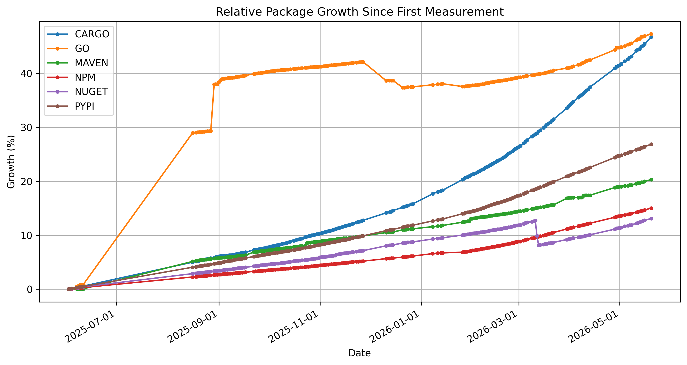

# Package registry size

Longitudinal study of package registries per <https://deps.dev/_/stats>

## Utils

###  get_package_stats.py

`get_package_stats.py` compute the total number of dependents

```
....
Version 2.9.0: 885 dependents
Version 2.9.1: 1170 dependents
Version 3.0.0-alpha1: 79 dependents
Version 3.0.0-beta1: 32 dependents
Version 3.0.0-beta2: 188 dependents
Total unique dependents for org.apache.logging.log4j:log4j-api: 15378
```

## extract-history.sh

go over each past commit and copy version of stats.json at that commit in directory `history`

## create-graph.py

Create line charts for number of dependencies over time

### Absolute Growth (deps.dev data)


Something happened in NPM counting

### Relative Growth (deps.dev data)


Max derivative is Cargo

## Dependency-graph visibility gap

The deps.dev package counts index only packages that appear in at least one resolved dependency graph. Cross-referencing with PyPI's full upload metadata (BigQuery `bigquery-public-data.pypi.distribution_metadata`) reveals a substantial visibility gap. In June 2025 deps.dev reported approximately 613,000 PyPI packages, growing to ~778,000 by May 2026 (+27%). The absolute monthly new-package rate from BigQuery (~12,000–25,000/month over the same window) is roughly four times higher than the monthly increments visible in deps.dev (~3,000–22,000/month). Package-count metrics derived from dependency-graph indexes substantially underestimate the true rate of package creation on PyPI.
